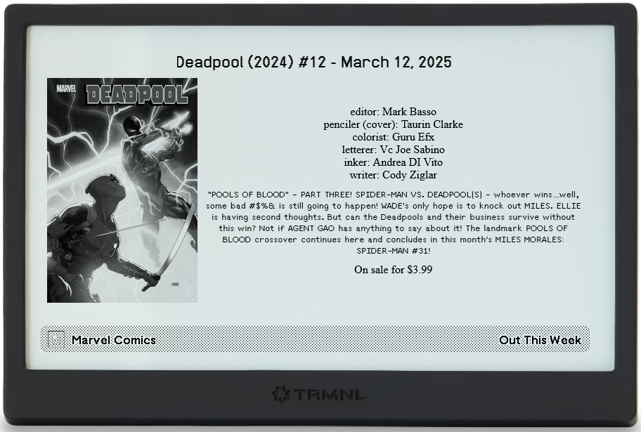

# trmnl-marvel-comic-tracker



A Plugin for the TRMNL device that tracks Marvel Comic series by using the official Marvel Comics API

## Setup For Use

### In `server/`

Create a .env file and add the following fields

- `MARVEL_PUB_KEY`: Public key from Marvel API dashboard
- `MARVEL_PRIV_KEY`: Private key from Marvel API dashboard

Also, create a file at `server/series.json` file that will list the IDs for each series. If you go to a series from this page: https://www.marvel.com/comics/series, the series ID will be in the URL.

For example:

```json
[
  { "id": 38806, "name": "Ultimate Black Panther (2024)" },
  { "id": 38809, "name": "Ultimate Spider-Man (2024)" },
  { "id": 38865, "name": "Ultimates (2024)" }
]
```

Finally run `npm install`, and `node index.js`

## Starting The Preview

- cd into server/ and run `node index.js`
- in another terminal cd into the root folder of the project and run:

```
gem install trmnl_preview
trmnlp serve
```
